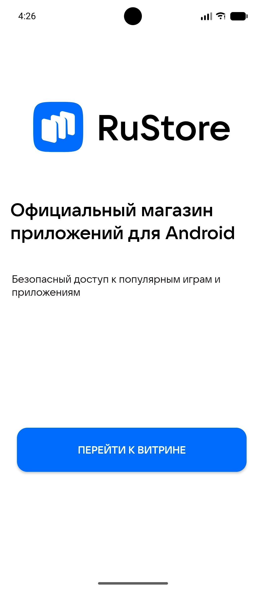

## RuStore (клиент)

### Возможности
- Лента/каталог приложений с сервера (`GET /apps`)
- Реализованы все обязательные экраны и их функционал
- Загрузка APK через серверную задачу (polling статуса)
- Запуск системной установки APK (через стандартный Android installer)

### Технологии
- Kotlin, Android SDK
- Retrofit + OkHttp
- kotlinx.serialization
- Glide
- Foreground Service для загрузки

### Требования
- Android Studio (актуальная версия)
- JDK 11 (проект собирается с `JavaVersion.VERSION_11`)
- Устройство/эмулятор Android (minSdk 24)
- Запущенный backend (см. “Сервер” ниже)

### Настройка backend URL
Базовый URL задаётся в файле:
`app/src/main/java/com/alyona/rustore/ui/theme/network/ApiConfig.kt`

По умолчанию:
- `http://10.0.2.2:8080/` — это **localhost хоста** для Android Emulator.

### Сборка и запуск (Android Studio)
1. Склонировать репозиторий:
   - `git clone <repo>`
2. Открыть проект в Android Studio
3. Дождаться Gradle Sync
4. Запустить конфигурацию `app` на устройстве/эмуляторе

### Реализация установки приложений (в общих чертах)
- Клиент получает список приложений с backend.
- По кнопке “Установить” запускается `ApkDownloadService`:
  - создаёт задачу скачивания на сервере
  - опрашивает статус (`/tasks/{id}/status`)
  - после завершения скачивает готовый APK
  - открывает системный установщик через `ACTION_INSTALL_PACKAGE`
  - **удаления** через это приложение - **нет** (м.б. я не так поняла требования, но на всякий случай,
если всё-таки надо было реализовать удаление приложение через это приложение, я этого не сделала, ибо это часть функционала ОС, вот)

### Сервер

Ссылка на репозиторий бэка: `https://github.com/Alohhhis/rustore-server`

## Требования
- JDK 17+
## Сборка и запуск
\`\`\`bash
./gradlew build
./gradlew run
\`\`\`
Сервер: http://localhost:8080

###  из IDE
Откройте проект в IntelliJ IDEA, запустите `main` в `src/main/kotlin/Main.kt` и всё

